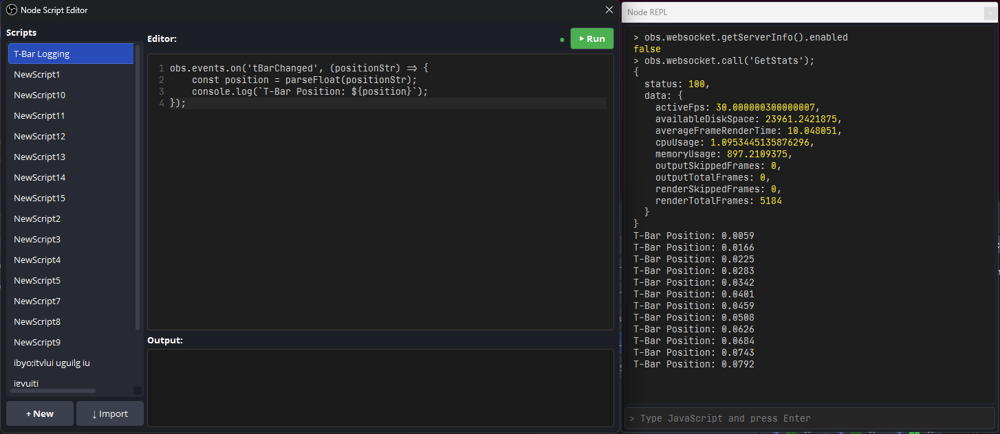

# OBS Node.js Plugin


**Bring in the power of the Node.js ecosystem to Supercharge your OBS Studio with JavaScript automation.**

Run scripts, automate scene switching, control filters dynamically, and build custom workflows—all using JavaScript and npm packages.

> ⚠️ **Early Development** — This plugin is under active development. Expect breaking changes between versions. Not recommended for production use yet.



---

## ✨ Features

- **🎬 Script Editor** — Built-in code editor with line numbers, zoom, and run-on-demand execution
- **💻 REPL Console** — Interactive JavaScript console for live experimentation
- **🔧 Full OBS API Access** — Control sources, scenes, filters, transitions, audio, and more
- **⚡ Event-Driven** — React to OBS events (scene changes, stream start/stop, etc.)
- **� WebSocket API (No Network)** — Direct access to obs-websocket protocol internally—no TCP connection needed
- **📡 Vendor Events** — Register custom vendor requests and emit events for external integrations
- **📦 Node.js Powered** — JavaScript runtime with basic Node.js APIs (full support planned)

---

## 🚀 Quick Examples

```javascript
// Switch to a scene
obs.frontend.setCurrentScene("Gaming")

// Toggle a source's visibility
obs.sceneItems.setVisible("Main Scene", "Webcam", false)

// Adjust filter settings on the fly
obs.filters.setSettings("Camera", "Color Correction", {
  brightness: 0.1,
  saturation: -0.5
})

// React to events
obs.events.on("StreamStarted", () => {
  console.log("We're live! 🎉")
})

// Direct WebSocket API access (no network!)
const list = obs.websocket.call('GetSceneItemList', {
    sceneName: "My Scene"
});

// Register vendor request handler
obs.websocket.on("myVendor", "doSomething", (data) => {
  console.log("Received:", data)
  return { success: true }
})

// Emit vendor event to connected clients
obs.websocket.emit("myVendor", "statusUpdate", { status: "ready" })
```

---

## 📖 Documentation

- **[API Reference](docs/API.md)** — Complete API documentation with examples
- **[TypeScript Definitions](typings/obs.d.ts)** — Full type definitions for IDE support

---

## 🛠️ Installation

### Requirements
- OBS Studio 31.0 or later
- Windows 10/11 (macOS and Linux coming soon)

### From Releases
> 📦 **Coming soon!** Pre-built releases will be available once CI is ready.
> For now, please build from source.

### Building from Source
> 🔨 **Build instructions coming soon!** We're working on proper documentation.

---

## 🎯 Use Cases

| Scenario | What You Can Do |
|----------|-----------------|
| **Stream Automation** | Auto-switch scenes based on game state or viewer commands |
| **Dynamic Overlays** | Update text sources, trigger animations on events |
| **Filter Control** | Adjust color grading, zoom effects in response to actions |
| **Chat Integration** | Build custom chat bots that control OBS |
| **Timed Events** | Schedule scene changes, countdowns, breaks |
| **Multi-Stream** | Coordinate multiple sources and outputs programmatically |

---

## 🗺️ Roadmap

Planned features for future releases:

| Priority | Feature | Description |
|----------|---------|-------------|
| 🔥 High | **macOS & Linux Support** | Cross-platform builds (currently Windows-only) |
| 🔥 High | **Syntax Highlighting & IntelliSense** | Code editor with syntax colors and autocomplete |
| 🔥 High | **Hot Reload** | Auto-reload scripts on file changes |
| 🔥 High | **Extension/Plugin System** | Load and manage third-party JavaScript extensions |
| 🔥 High | **Multi-Script Parallel Runtime** | Run multiple scripts concurrently in isolated contexts |
| 🔧 Medium | **Debugging Tools** | Breakpoints, step-through debugging, variable inspection |
| 🔧 Medium | **Script Marketplace** | Community script sharing and discovery |
| 🔧 Medium | **Source Creation APIs** | Create custom OBS sources with JavaScript or WebAssembly |
| 🔧 Medium | **WebAssembly Support** | Run WASM modules for high-performance operations |
| 🔧 Medium | **JSX UI Components** | Figma-like API for building Qt UIs with JSX syntax |
| 🔧 Medium | **Canvas Drawing API** | HTML Canvas-like API to draw directly on OBS sources |
| 🔧 Medium | **FFI Module** | Access non-bound libobs APIs directly via foreign function interface |
| ⚙️ Low | **Runtime Version Selector** | Choose between LTS Node.js versions |

Have a feature request? [Open an issue](../../issues)!

---

## ⚠️ Early Development Notice

This plugin is in **active early development**. You should expect:

- 🔄 Breaking API changes between versions
- 🐛 Bugs and incomplete features
- 📝 Documentation gaps
- ⚙️ Platform limitations (Windows-only for now)

We welcome feedback, bug reports, and contributions! Please open an issue if you encounter problems.

---

## 🤝 Contributing

Contributions are welcome! Please:
1. Fork the repository
2. Create a feature branch
3. Submit a pull request

For bug reports and feature requests, please use [GitHub Issues](../../issues).

---

## 📄 License

This project is licensed under the **GNU General Public License v2.0** — see [LICENSE](LICENSE) for details.

Built with ❤️ for the OBS community.
